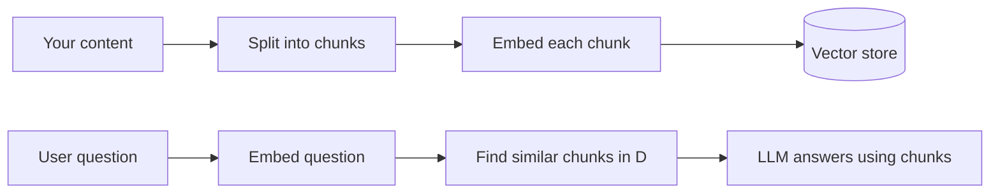

You will add a chat assistant that answers questions using *your* content (guides, docs, FAQs) instead of guessing. The pattern is **RAG**: retrieve relevant chunks of your text, then ask the model to answer using only those chunks.

## How RAG works



## 1. Store embeddings in Supabase (pgvector)

Supabase ships the `pgvector` extension. Enable it and create a table:

```sql
create extension if not exists vector;

create table documents (
  id uuid primary key default gen_random_uuid(),
  content text not null,
  embedding vector(1536)
);

alter table documents enable row level security;
create policy "documents_read" on documents
  for select to anon, authenticated using (true);
```

## 2. Embed your content

Run this once per chunk (server-side, secret key only):

```ts
const embed = await openai.embeddings.create({
  model: "text-embedding-3-small",
  input: chunkText,
});
await db.insert(documents).values({
  content: chunkText,
  embedding: embed.data[0].embedding,
});
```

Split long pages into ~500-token chunks so retrieval stays focused.

## 3. Answer a question

```ts
// 1. embed the question, 2. find nearest chunks, 3. answer from them
const matches = await supabase.rpc("match_documents", {
  query_embedding: questionEmbedding,
  match_count: 5,
});

const context = matches.data.map((m) => m.content).join("\n\n");

const answer = await openai.chat.completions.create({
  model: "gpt-4o-mini",
  messages: [
    {
      role: "system",
      content:
        "Answer using only the context below. If it is not there, say you do not know.\n\n" +
        context,
    },
    { role: "user", content: question },
  ],
});
```

Put all of this in a **Route Handler** (`src/app/api/chat/route.ts`) so the API key stays server-only.

## 4. Faster paths

If you do not want to wire vectors yourself:

| Option | What it does | Link |
| ------ | ------------ | ---- |
| **Vercel AI SDK** | Streaming chat UI + model routing in a few lines | [ai-sdk.dev](https://ai-sdk.dev) |
| **OpenAI Assistants / file search** | Upload files, OpenAI handles retrieval | [platform.openai.com](https://platform.openai.com) |
| **Supabase AI / pgvector** | Vector search next to your data | [supabase.com/docs/guides/ai](https://supabase.com/docs/guides/ai) |
| **Chatbase** | Hosted "chatbot from your site" with no code | [chatbase.co](https://www.chatbase.co) |

## 5. Stream the UI

Use the Vercel AI SDK's `useChat` hook on the client and stream tokens from your Route Handler. It handles loading states and message history for you.

## Security checklist

- Keep the model API key in a server-only env var. Never prefix it with `NEXT_PUBLIC_`.
- Rate-limit the chat endpoint so it cannot be abused to run up your bill.
- Validate the incoming message with Zod before calling the model.
- Tell the model to answer only from retrieved context to reduce made-up answers.

> Model and SDK names move fast. Confirm the current embedding and chat model before you build.
